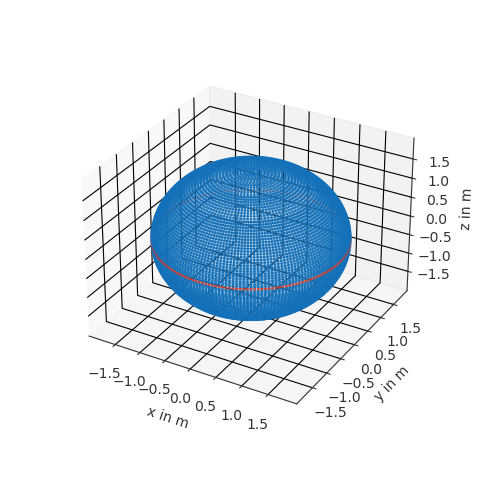
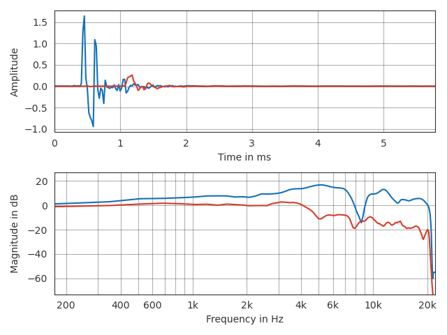

.. _working_with_sofa:

Working with SOFA files
-----------------------

The :ref:`quick_tour` showed how to access SOFA files. In many cases you will
want to have a closer look at the data inside a SOFA file or use it for further
processing. In this section, you will see examples of how to do that using
`pyfar <pyfar.org>`.

Retrieving data for specific source and receiver positions
==========================================================

In most cases SOFA files contain data for lots of source or receiver positions
and it is often important to get data for a specific position. An elegant way
of doing that is to use pyfar Coordinates and Audio objects. Coordinate objects
have built in methods to search specific positions and they can convert between
a large variety of coordinate systems for you. For audio objects, there is
a growing pool of functions for plotting and processing that comes in handy. To
use pyfar install it into you python environment

.. code:: shell

    $ pip install pyfar

You have to options to get SOFA data into pyfar. The first option is to load
the SOFA file with :code:`sofar.read_sofa` and then manually generate Audio
and Coordinates objects from the data inside the SOFA file. The second option
is to use :code:`pyfar.read_sofa`, which directly returns the Audio and
Coordinates objects. Lets be lazy and do that

.. code:: python

    import pyfar as pf
    data_ir, source_coordinates, receiver_coordinates = pf.io.read_sofa(
        'FABIAN_HRIR_measured_HATO_0.sofa')

The SOFA file used in this example is contained head-realated impulse responses
(HRIRs) from the `FABIAN database <https://depositonce.tu-berlin.de/handle/11303/6153.5>`_.
Lets find the HRIR for the source position at the left ear on the horizontal
plane. It has an azimuth angle of 90 degrees and an elevation of 0 degrees

.. code:: python

    index, *_ = source_coordinates.find_nearest_k(
        90, 0, 1.5, k=1, domain='sph', convention='top_elev', unit='deg', show=True)

The variable ``index = 5930`` tells us where to find data for the desired
source position. Since we used ``show=True`` we also get visual feedback for
checking if we got the correct source

|source_lateral|

Note that you get more then the most closest point by using different values
for `k`. It is also possible to all source positions on or in the vicintiy
of the horizontal plane using the ``find_slice`` method of the Coordinates
object. Sources on the horizontal plane have zero degree elevation and thus can
be obtained by

.. code:: python

    mask = source_coordinates.find_slice(
        'elevation', unit='deg', value=0, show=True)

Again, we get visual feedback if we want

|source_horizontal|

Plotting data
=============

Ploting can be done with the built in plot functions. For example to take a
look at the time data and magnitude spectra of a single source position

.. code:: python

    pf.plot.time_freq(data_ir[index])

|hrir_lateral|

Next steps
==========

For detailed information about sofar refer to the :ref:`sofar_documentation`.
Pyfar also offers methods for digital signal processing that wont be detailed
here. A god way to dive into that is the
`pyfar documentation <https://pyfar.readthedocs.io/en/latest/>`_ and the
`pyfar examples notebook <https://mybinder.org/v2/gh/pyfar/pyfar/main?filepath=examples%2Fpyfar_demo.ipynb>`_.

.. |source_lateral| image:: resources/working_with_sofa_source_lateral.png
   :width: 500
   :alt: source lateral

